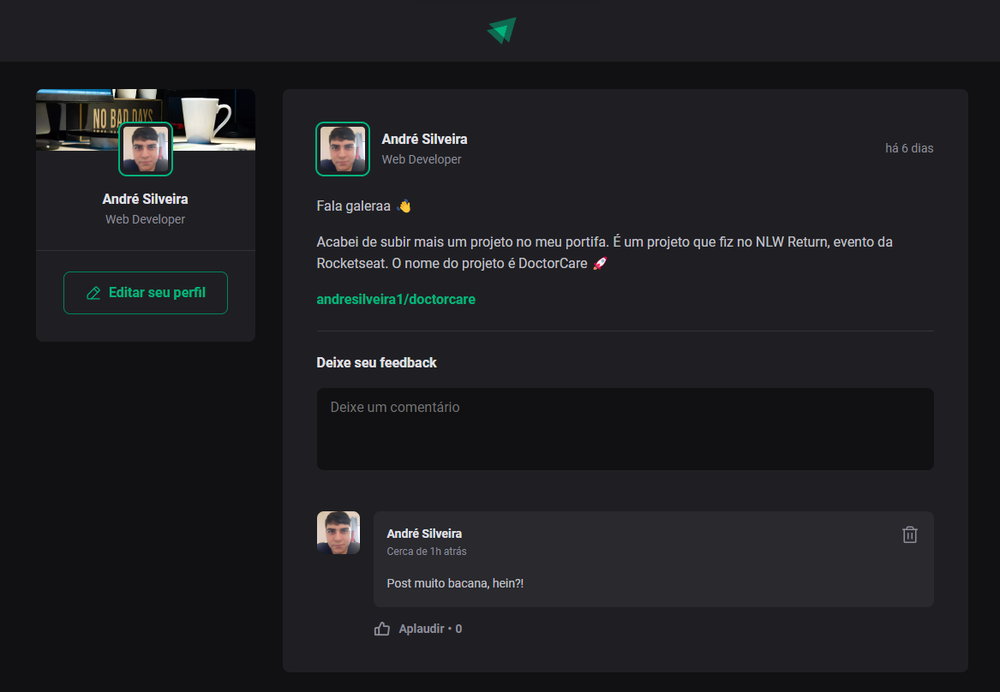

<h1 align="center">Ignite Feed</h1>

Ignite feed is a project from the boot camp Ignite on [Rocketseat](https://www.rocketseat.com.br/), a page that represent a social media simulation.

## [WebSite](https://ignite-feed-rosy-kappa.vercel.app/)

I've used this project to improve my knowledge on States, properties, components, and Typescript. On this app you can write and post a comment, likes and delete.

 

# Technologies

- Vitejs
- Reactjs
- Typescript
- date-fns

 

# Layout

You can view layout on figma by clicking [here](https://www.figma.com/community/file/1113573231685349036).
